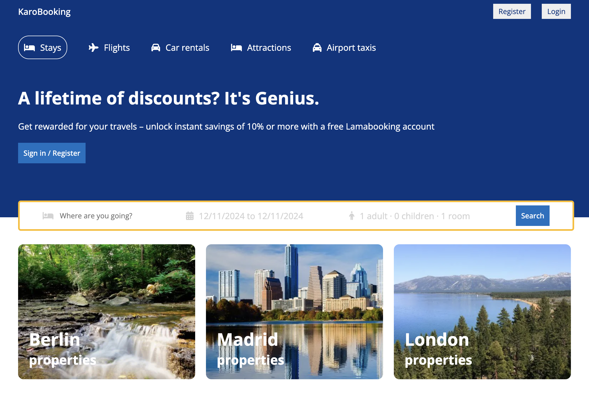

# Booking app

This application allows users to book accommodations.

As a user, you can sign up, log in, and book rooms. Your password is securely hashed for safety.
As an admin, you can add hotels and rooms, view users, and manage accommodations.
The application includes routing and schemas for users, hotels, and rooms.

## Tech Stack

-   Frontend: React (React Router, Context API)
-   Backend: Node.js / Express.js
-   Database: MongoDB / Mongoose
-   Security: BCrypt.js, JWT Token
-   Development Tools: Nodemon, Dotenv
-   HTTP Client: Axios

## Demo:

